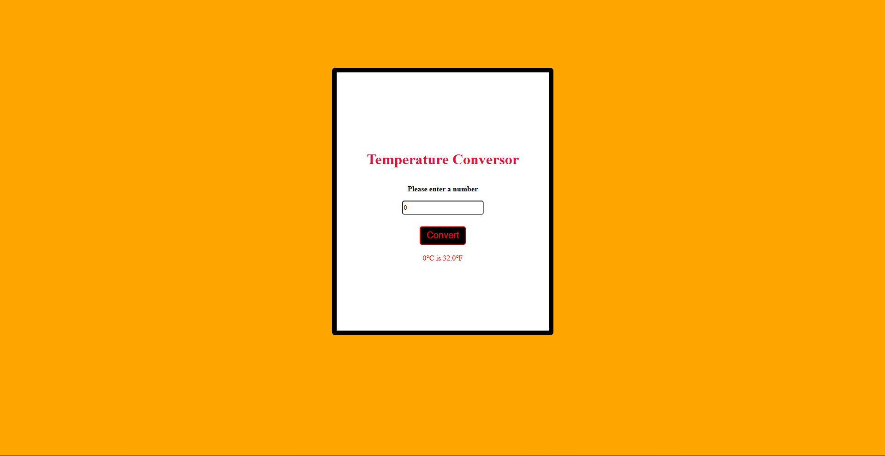

# 🌡️ Temperature Converter

A simple and responsive web application that converts temperatures from Celsius to Fahrenheit. This project was built to practice DOM manipulation, JavaScript logic, and CSS styling.

## 🚀 Features

- **Real-time Conversion:** Converts Celsius to Fahrenheit instantly on click.
- **Input Validation:** Prevents errors by checking if the input is a valid number.
- **Responsive Design:** Clean and centered interface that works on different screen sizes.
- **Modern UI:** Dark-themed button with high-contrast colors.

## 🛠️ Technologies Used

- **HTML5:** Semantic structure.
- **CSS3:** Custom styling and layout centering.
- **JavaScript (ES6+):** Logic, event listeners, and dynamic DOM updates.

## 📝 How to use

1. Enter a number in the input field.
2. Click the **Convert** button.
3. The result will appear below the button. If the input is empty or invalid, an error message will be displayed.

## 📸 Preview

